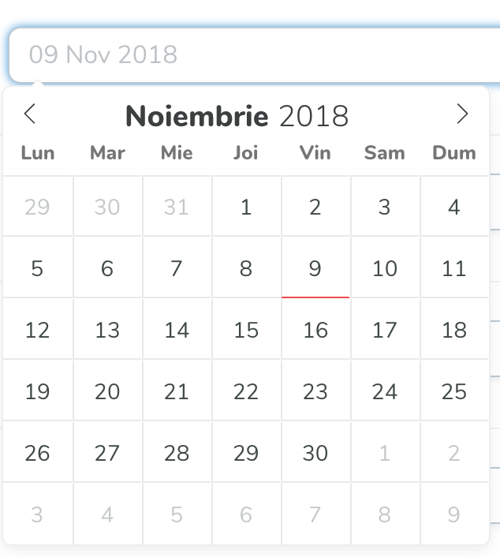

# Romanian Date

##### Romanian Date Picker for Laravel Nova

Apply Romanian localisation to Laravel Nova's default `Date` field that currently doesn't support localisation out of the box.

This package uses the airbnb theme.



## Install

In order to install this, run the following command:

```bash
composer require niladam/romanian-date
```

## Usage

It uses the same API as [Nova's default `Date` Field](https://nova.laravel.com/docs/1.0/resources/fields.html#date-field)

Use `RomanianDate` class instead of `Date` directly or use it like an alias in the below example in order to not refactor too much.

```php
<?php

namespace App\Nova;

use Illuminate\Http\Request;
use Madalin\RomanianDate\RomanianDate as Date;

class User extends Resource
{
    // [..]

    /**
     * Get the fields displayed by the resource.
     *
     * @param  \Illuminate\Http\Request $request
     * @return array
     */
    public function fields(Request $request)
    {
        return [
            ID::make()->sortable(),

            Text::make(__('Name'), 'name')
                ->sortable()
                ->rules('required', 'max:255'),

            Text::make(__('Email Address'), 'email')
                ->sortable()
                ->rules('required', 'email', 'max:254')
                ->creationRules('unique:users,email')
                ->updateRules('unique:users,email,{{resourceId}}'),

            Password::make(__('Password'), 'password')
                    ->onlyOnForms()
                    ->creationRules('required', 'string', 'min:6')
                    ->updateRules('nullable', 'string', 'min:6'),

            Date::make(__('Updated at'), 'updated_at')
                    ->format('DD MMM YYYY')
                    ->updateRules('required', 'date')
                    ->hideFromIndex(),
        ];
    }
}

```
